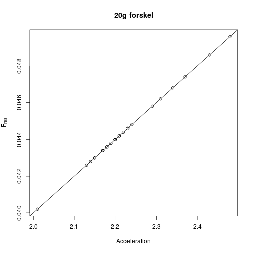

#Atwoods faldmaskine
1. I del 3 beregnes $F_{res}$, der er konstant. Tegn $(a, F_{res})$ grafen. Bestem liniens hældning og sammenlign denne med den samlede masse  
2. I del 2 tegnes en $\left( \frac{1}{M_{1}+M_{2}},a \right)$ graf. Ser grafen ud som forventet? Bestem liniens hældning og sammenlign denne med $F_{res}$  
3. Konkluder på gyldigheden af Newtons 2. lov.f  
4. Undersøg om den mekaniske energi er bevaret under bevægelsen. Kommenter resultatet.  
   
    
    ```r
    x <- seq(-20, 20, length=200)
    y <- sapply(x, FUN = function(x){x^2})
     
    plot(x, y, type='l')
    ```
    
    
