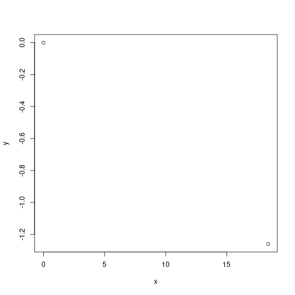

---
header-includes:
	\usepackage{fancyhdr}
	\pagestyle{fancy}
	\lhead{Jeppe Møldrup}
	\chead{Fysik aflevering 2}
	\rhead{17-9/2018}
---

# Fysik aflevering 2

## Opgave 1
En ishockeyspiller sender pucken afsted fra den ene ende af banen.
Pucken når lige netop at glide frem til den anden ende af banen.  

a. Tildel passende værdier til relecante fysiske størrelser, og brug disse til at
   vurdere, hvor stor en begyndelsesfart pucken skal have for at kunne glide fra
   den ene ende af banen til den anden.  
   Gør herunder rede for relevante antagelser.  

   Jeg antager at banen er 150 meter lang, pucken vejer 200 gram og at
   gnidningskoefficienten mellem gummi og is er $\mu=0.1$  
   Bevægelsen er lineær bevægelse hvor den resulterende kraft på pucken er
   friktionskraften fra gnidningen mellem gummiet og isen.  
   Friktionskraften bestemmes med formlen  
   $$F_{gnid}=\mu \cdot F_{N}$$  
   Hvor $\mu$ er gnidningskoefficienten og $F_{N}$ er normalkraften.  
   Da normalkraften er $F_{N}=F_{tyngde}=m \cdot a$ kan formlen omskrives til  
   $$F_{gnid}=\mu \cdot m \cdot 9.82 \ \frac{m}{s^2}$$  
   Så friktionskraften er  
   $$F_{gnid}=0.1 \cdot 0.2 \ kg \cdot 9.82 \ \frac{m}{s^2}=0.20 \ N$$  
   da normalkraften og tyngdekraften udligner hinanden og der ikke er nogle andre
   kræfter til stede er $F_{res}=F_{gnid}$ Og da $F_{res}=m \cdot a$ kan vi nu finde
   accelerationen på pucken.  
   $$\frac{F_{gnid}}{m}=a \Leftrightarrow \frac{0.20 \ N}{0.2 \ kg}=1 \ \frac{m}{s^2}$$  
   Så accellerationsfunktionen på pucken er $a(t)=-1 \ \frac{m}{s^2}$(negativ fordi
   pucken ikke accellerere men den decellerere) så jeg kan integrere
   det for at få hastighedsfunktionen.  
   $$v(t) = \int -1 \ \frac{m}{s^2} \ dx = -1 \cdot t + v_0$$  
   Og jeg kan integrere en gang mere for at få stedfunktionen.  
   $$s(t) = \int -1 \cdot t + v_0 \ dx = -0.5 \cdot t^2 + v_0 \cdot t + s_0$$
   Pucken har startstedet 0 så stedfunktionen bliver  
   $$s(t)=-0.5 \cdot t^2 + v_0 \cdot t$$  
   Til stedet 150 ved jeg at hastigheden er nul så jeg har de to ligninger
   med to ubekendte  
   $$0=-1 \cdot t + v_0$$
   $$150 = -0.5 \cdot t^2 + v_0 \cdot t$$
   Jeg isolere $v_0$ i første ligning
   $$v_0 = t$$
   og indsætter i den anden ligning  
   $$150 = -0.5 \cdot t^2 + t^2 = t^2(-0.5+1) = 0.5 \cdot t^2$$
   Så finder jeg t  
   $$t = sqrt(300)$$
   Nu kan jeg finde $v_0$ fra den anden ligning
   $$v_0 = t \Leftrightarrow v_0 = sqrt(300) = 17.32 \ \frac{m}{s}$$  
   Så pucken ville have en starthastighed på $17.32 \ \frac{m}{s}$

## Opgave 2
En Kenguru med chauffør har massen 575 kg. Når bilen sætter i gang, har den samlede
kraft på bilen størrelsen $2.1 \ kN$.  

a. Bestem størrelsen af bilens acceleration, når bilen sætter i gang  
   
   Jeg bruger formlen  
   $$F=m\cdot a$$
   og isolerer a  
   $$a=\frac{F}{m}$$  
   Så indsætter jeg mine værdier  
   $$a=\frac{2100 \ N}{575 \ kg}=3.65 \ \frac{m}{s^2}$$  
   Så accelerationen når bilen sætter i gang er $3.65 \ \frac{m}{s^2}$  

Med et fuldt opladet battery kan elmotoren levere $36 \ MJ$ energi til bilen. Ved kørsel med
farten $38 \ km/h$ kan bilen køre $95 \ km$, før batteriet skal lades op.  

b. Bestem elmotorens effekt, når bilen kører med den konstante fart $38 \ km/h$  
   
   Jeg starter med at tage hastigheden og dividere den op i længden bilen kan køre.  
   $$\frac{95 \ km}{38 \ km/h}=2.5 \ h$$  
   Det fortæller mig at det tager 2.5 timer at køre strækningen $95 \ km$ ved hastigheden
   $38 \ km/h$ dvs. at det tager 2.5 timer at køre batteriet helt flat. Så nu tager jeg
   bare energien i et fuldt batteri og dividere med 2.5 timer for at få elmotorens
   effekt.  
   $$\frac{36 \ MJ}{2.5 \ h}=4000 \ W$$  
   Så elmodorens effekt ved hastigheden $38 \ km/h$ er $4000 \ W$

## Opgave 3

I baseball står en kaster $18.4 \ m$ fra en spiller, der skal ramme bolden med et bat.  

a. Beregn, hvor lang tid det tager en bold at flyve $18.4 \ m$ med den konstante
   fart $166 \ km/h$.  
   
   Først skal jeg ændre farten om til $m/s$  
   $$166 \ km/h \cdot \frac{1000 \ m/km}{3600 \ s/h} = 46.1 \ m/s$$  
   Nu kan jeg tage distancen divideret med hastigheden for at finde det antal sekunder
   det tager bolden at flyve de $18.4 \ m$  
   $$\frac{18.4 \ m}{46.1 \ m/s}=0.40 \ s$$  
   Så det tager bolden $0.40 \ s$ at flyve $18.4 \ m$ ved hastigheden $166 \ km/h$.  

I et baseballkast slippes bolden med farten $140 \ km/h$ med en vinkel lidt under
vandret. Når battet rammer bolden befinder den sig $1.26 \ m$ under den højde,
hvor kasteren slap den.  

b. Vurdér med hvilken vinkel lidt under vandret bolden skal kastes, når battet
   rammer bolden $1.26 \ m$ lavere end, hvor den blev sluppet.  
   
   Jeg kender to punkter for bolden, nemlig startstedet $(0, 0)$ og der hvor
   bolden rammer battet $(18.4, 1.26)$ Så jeg påfører regression i form
   af en andengradsligning på de to punkter.  
   
   ```r
   x = c(0, 18.4)
   y = c(0, 1.26)
   
   fit = nls(y ~ a*x*x+b*x, data=data.frame(x, y), start = list(a = -1, b = -1))
   ```
   
   ```
   ## Error in nlsModel(formula, mf, start, wts): singular gradient matrix at initial parameter estimates
   ```
   
   ```r
   plot(x, y)
   ```
   
   
   
   ```r
   abline(fit)
   ```
   
   ```
   ## Error in abline(fit): object 'fit' not found
   ```
