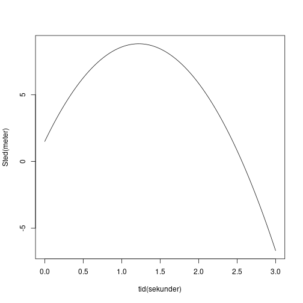
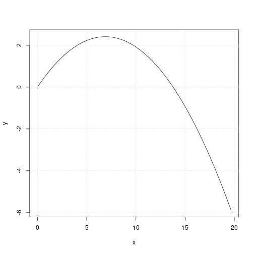

## 6.12

En bold bliver kastet lodret opad med begyndelsesfarten 12 m/s.
Bolden bliver sluppet i højden 1,5 m over jordoverfladen. Antag, at der ikke
er nogen luftmodstand.

a. Tegn en graf med bolden højde som funktion af tiden.
   
   Jeg bruger formlen for det lodrette kast
   $$y(t) = -\frac{1}{2} \cdot g \cdot t^2 + v_0 \cdot t + y_0$$
   Og indsætter værdierne
   $$y(t) = -4.91 \cdot t^2 + 12 \ \frac{m}{s} \cdot t + 1.5 \ m$$

    

   \pagebreak

b. Hvor lang tid går der, før bolden når den maksimale højde?
   
   Jeg finder punktet hvor tangenthældningen er 0
   $$s(t)=-4.91 \cdot t^2 + 12 \ \frac{m}{s} \cdot t + 1.5 \ m$$
   $$s'(t)=v(t)=-9.82 \ \frac{m}{s^2}\cdot t+12 \ \frac{m}{s}$$
   $$solve(s'(t)=0, t) \rightarrow 1.222 \ s$$
   Så der går omkring 1.2 sekunder før bolden har nået sin maksimale højde

c. Hvor højt når bolden op?
   
   Jeg indsætter bare tiden til toppunktet ind i stedfunktionen
   $$s(1.2 \ s) = -4.91 \cdot 1.2^2 \ s + 12 \ \frac{m}{s} \cdot 1.2 \ s + 1.5 \ m = 8.8296$$
   Så bolden når 8.8 meter op

d. Hvor lang tid går der, før bolden rammer jordoverfladen?
   
   Jeg finder alle punkter hvor stedfunktionen krydser x-aksen
   $$solve(-4.91 \cdot t^2 + 12 \ \frac{m}{s} \cdot t + 1.5 \ m = 0, t) \rightarrow t = -0.11919 \vee t = 2.5632$$
   Jeg vælger den positive løsning så der går omkring 2.6 sekunder før bolden rammer jorden.

e. Beregn den fart, hvormed bolden rammer jordoverfladen?
   
   Jeg indsætter bare tiden ind i hastighedsfunktionen
   $$v(2.5632) = -9.82 \ \frac{m}{s^2} \cdot 2.5632 + 12 \ \frac{m}{s} = -13.170624 \ \frac{m}{s}$$
   Det er hastigheden, så jeg tager den numeriske værdi for at finde farten
   $$|-13.17| = 13.17$$
   Så når den rammer jorden har den en fart på cirka $13 \ \frac{m}{s}$

## 6.13

En bold kastes lodret op, så den når en højde på 35 m over starthøjden.
Hvor stor var bolden begyndelsesfart? Se bord fra luftmodstand.  

Igen er det lodret kast så vi har formlerne
$$s(t) = -4.91\cdot t^2 + v_0\cdot t + s_0$$
$$v(t) = -9.82 \cdot t + v_0$$
Jeg antager at $s_0$ igen er 1.5 m  
Vi ved at til stedet 35 er hastigheden 0, så vi har to ligningen med
to ubekendte, så jeg substituerer
$$35 = -4.91\cdot t^2 + v_0\cdot t + 1.5 \ m$$
$$0 = -9.82\cdot t + v_0 \Leftrightarrow t = \frac{v_0}{9.82}$$
$$35 = -4.91\cdot \frac{v_0^2}{9.82^2} + v_0 \cdot \frac{v_0}{9.82} + 1.5 \ m \rightarrow v_0 = 25.650$$
Så bolden har en begyndelsesfart på cirka 26 m/s

## 6.14

En sten kastes i et skråt kast. Begyndelseshastigheden i vandret retning er $v_{0x}=9.83 \ m/s$, og begyndelseshastigheden
i lodret retning er $v_{0y}=6.88 \ m/s$. Startpositionen i vandret retning er $x_0 = 0$, og startpositionen i lodret
retning er $y_0 = 0$.

a. Tegn banekurven. Brug evt. et matematikprogram eller en grafregner.
   
   Jeg bruger formlerne
   $$x = v_{0x}\cdot t + x_0$$
   $$y = -\frac{1}{2}\cdot g\cdot t^2 + v_{0y}\cdot t+y_0$$
   Og plotter x og y

    

   \pagebreak

b. Find boldens maksimale højde
   
   Igen tager finder jeg hastighedsfunktionen i lodret retning og finder der hvor den er 0
   $$s_y(t) = -4.91\cdot t^2 + 6.88\cdot t$$
   $$v_y(t) = -9.82\cdot t + 6.88$$
   $$solve(v_y(t)=0, t) \rightarrow t = 0.7$$
   Så indsætter jeg det i stedfunktionen
   $$s_y(0.7) = -4.91\cdot 0.7^2 + 6.88\cdot 0.7 = 2.4$$
   Så boldens maksimalhøjde er 2.4 meter.

c. 
