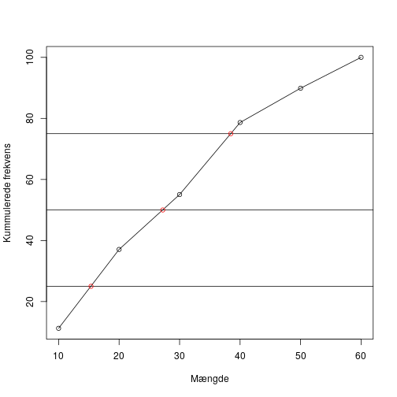

# Matematik aflevering 1

# 9.168
Løs ligningen $x^2+x-12=0$  
Ligningen er en andengradsligning da der er $x^2$ og $x$  
Jeg starter med at finde deskriminanten
$$d = b^2-4ac$$

Værdierne for denne ligning er $a = 1,\ b = 1,\ c = -12$  
Jeg indsætter dem
$$d = 1^2-4 \cdot 1 \cdot -12 = 1-(-48) = 49$$

Så bruger jeg formlen
$$x = \frac{-b \pm \sqrt[]{d}}{2a}$$

Jeg indsætter mine værdier
\begin{align*}
x & = \frac{-1 \pm \sqrt[]{49}}{2 \cdot 1} = \frac{-1 \pm 7}{2}\\
x & = -4 \vee x = 3
\end{align*}

Så løsningen på andengradsligningen er $x = 4 \vee x = -0.5$

# 9.169
I et koordinatsystem er to vektorer $\vec{a}$ og $\vec{b}$ bestemt ved
$$\vec{b} = \begin{pmatrix} 2 \\ t + 1 \end{pmatrix} \ og \ \vec{b} = \begin{pmatrix} t - 1 \\ 3 \end{pmatrix}$$

Jeg ved at hvis de skal være orthogonale skal deres prikprodukt være $0$ dvs.
$$\vec{a} \cdot \vec{b} = 0 \Leftrightarrow \begin{pmatrix} 2 \\ t + 1 \end{pmatrix} \cdot \begin{pmatrix} t - 1 \\ 3 \end{pmatrix} 
\Leftrightarrow 2 \cdot (t - 1) + (t + 1) \cdot 3 = 0$$

Så har vi en ligning hvor vi kan isolere og finde t
$$2t-2+3t+3=0 \Leftrightarrow 5t = -1 \Leftrightarrow t = -0.2$$

Så hvis vectorerne $\vec{a}$ og $\vec{b}$ skal være orthogonale skal t være -0.2

#9.171
En funktion $f$ er bestemt ved
$$f(x) = e^x - x - 1$$
Undersøg om $f$ er en løsning til differentialligningen
$$\frac{dy}{dx} = y + x$$

Jeg starter med at indsætte $f(x)$ ind på y's plads
$$\frac{dy}{dx} = e^x - x - 1 + x = e^x - 1$$
Så finder jeg $f'(x)$ og ser om den er ens med ovenstående da $$\frac{dy}{dx} = f'(x)$$
$$f'(x)=(e^x - x - 1)'= e^x - 1$$

Jeg ser så at de er ens og derfor ved jeg at $f(x)$ er en løsning til differentialligningen

#9.175

| Mængde| Kunder|
|------:|------:|
|     10|     10|
|     20|     23|
|     30|     16|
|     40|     21|
|     50|     10|
|     60|      9|
Tegn en sumkurve, og bestem kvartilsættet  

Jeg starter med at finde frekvensen for hvert interval ved at tage antal kunder i intervallet og dividere det med antallet af
kunder i alt

| Mængde| Kunder| Frekvens|
|------:|------:|--------:|
|     10|     10| 11.23596|
|     20|     23| 25.84270|
|     30|     16| 17.97753|
|     40|     21| 23.59551|
|     50|     10| 11.23596|
|     60|      9| 10.11236|

Så finder jeg den kummulerede frekvens

| Mængde| Kunder| Frekvens|   Kumfrek|
|------:|------:|--------:|---------:|
|     10|     10| 11.23596|  11.23596|
|     20|     23| 25.84270|  37.07865|
|     30|     16| 17.97753|  55.05618|
|     40|     21| 23.59551|  78.65169|
|     50|     10| 11.23596|  89.88764|
|     60|      9| 10.11236| 100.00000|

Så kan jeg plotte dataet ind med Mængden på x-aksen og den kummulerede frekvens på y-aksen og aflæse hvor på grafen henholdsvis 25,
50 og 75 procent skærer grafen så jeg kan finde kvartilsættet

\pagebreak

Så kan jeg så aflæse kvartilsættet på grafen til at være  
$Q_{1}=$ 15.4 $median=$ 27.2 $Q_{3}=$ 38.5
