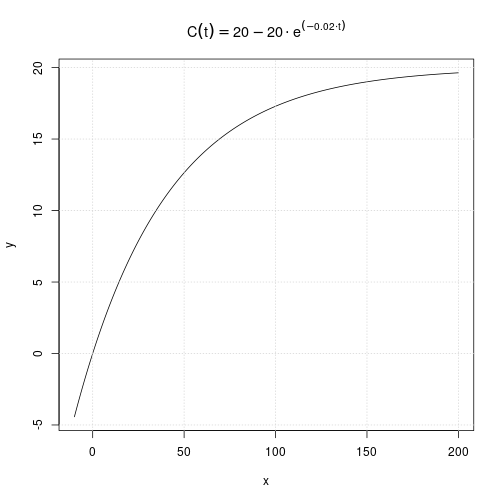

---
header-includes:
	\usepackage{fancyhdr}
	\pagestyle{fancy}
	\lhead{Jeppe Møldrup}
	\chead{Matematik aflevering 2}
	\rhead{10/9-2018}
---

#9.210, 9.211, 9.215, 9.220, 9.221 og 9.223

## 9.210
Reducér udtrykket $(a-b)^2+2a(a+b)-b^2$  
Jeg stater med at gange $2a$ ind i parantesen  
$$(a-b)^2+2a^2+2ab-b^2$$  
Derefter omskriver jeg første led da det er en kvadratsætning  
$$a^2+b^2-2ab+2a^2+2ab-b^2$$  
Og så reducérer jeg  
$$3a^2$$  
Så udtrykket reducéret bliver $3a^2$ 

## 9.211
I et koordinatsystem er to vektorer givet ved  
$$\vec{a}=\begin{pmatrix} 2 \\ t \end{pmatrix} \ og \ \vec{b}=\begin{pmatrix} -3 \\ 4 \end{pmatrix}$$  
hvor $t$ er et tal.  
bestem $t$, så vektorerne $\vec{a}$ og $\vec{b}$ er ortogonale.  

Jeg ved at hvis de to vektorer skal være ortogonale skal deres prikprodukt være lig nul. dvs.  
$$\vec{a} \cdot \vec{b} = 0 \qquad a_x \cdot b_x + a_{y} \cdot b_{y} = 0$$  
Så jeg indsætter mine værdier
$$2 \cdot -3 + t \cdot 4 = 0 \Leftrightarrow t = \frac{6}{4}=1.5$$  
Så min værdi for t er $t = 1.5$  

## 9.215
I et hushjørne er der en indhegning til kaniner.  
Indhegningen består af et kcadratisk tag og to rektangulære sider. Højden betegnes med $h$, og sidelængden i kvadratet betegnes med $x$.  
Det oplyses, at rumfangen af indhegningen er $9 \ m^3$.  

Bestem højden $h$ udtrykt ved $x$. Bestem det samlede areal af de to rektangulære sider og det kvadratiske tag udtrykt ved $x$.  

Jeg tager formlen for arealet af en kasse  
$$V_{kasse}=h \cdot l \cdot b$$  
Da $x$ er både længde og bredde er formlen  
$$V_{kasse}=h \cdot x^2 \Leftrightarrow h=\frac{V_{kasse}}{x^2}$$  
Da jeg ved at rumfanget skal være $9 \ m^3$ indsætter jeg det ind i formlen og så har jeg formlen for $h$ udtrykt ved $x$  
$$h=\frac{9}{x^2}$$  
Så højden $h$ udtrykt ved $x$ er $h=\frac{9}{x^2}$ og de rektangulære sider er $h \cdot x$ og taget er $x^2$.

## 9.220
Fra et rør løber forurenet cand net i en tønde med cand. Med $C(t)$ betegnes koncentrationen (målt i ppm) af det forurenende stof i tønden til tidspunktit $t$ (målt i minutter).
I en model antages det, at $C(t)$ er en løsning til differentialligningen  
$$\frac{dC}{dt} = 0.4-0.02 \cdot C$$  
Det oplyses at $C(0)=0$.  

a. Bestem en forskrift for $C(t)$.  
For at finde forskriften for $C(t)$ skal jeg finde løsning til differentialligningen, dette gør jeg vha. desolve.  
$$dsolve(C'(t)=0.4-0.02C and C(0)=0,t,c) \Rightarrow C(t)=20-20e^{-0.02t}$$


```r
c <- function(t){20-20*exp(-0.02*t)}

x <- seq(-10, 200, by=0.5)
y <- sapply(x, FUN=c)

plot(x, y, type='l', main=expression(C(t) == 20 - 20 %.% e^(-0.02 %.% t)))
grid()
```



b.  

c.  
