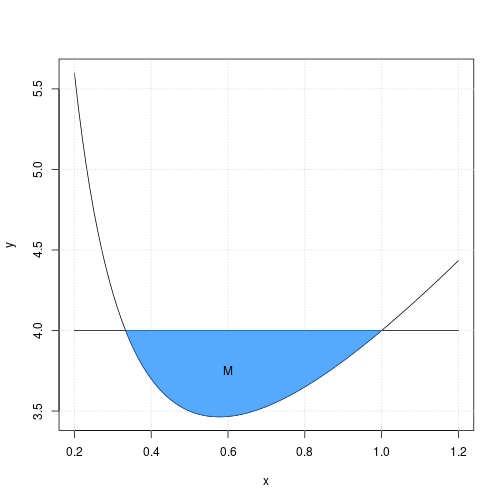

---
header-includes:
	\usepackage{fancyhdr}
	\pagestyle{fancy}
	\lhead{Jeppe Møldrup}
	\chead{Matematik aflevering 2}
	\rhead{10/9-2018}
---

#9.210, 9.211, 9.215, 9.220, 9.221 og 9.223

## 9.210
Reducér udtrykket $(a-b)^2+2a(a+b)-b^2$  
Jeg stater med at gange $2a$ ind i parantesen  
$$(a-b)^2+2a^2+2ab-b^2$$  
Derefter omskriver jeg første led da det er en kvadratsætning  
$$a^2+b^2-2ab+2a^2+2ab-b^2$$  
Og så reducérer jeg  
$$3a^2$$  
Så udtrykket reducéret bliver $3a^2$ 

## 9.211
I et koordinatsystem er to vektorer givet ved  
$$\vec{a}=\begin{pmatrix} 2 \\ t \end{pmatrix} \ og \ \vec{b}=\begin{pmatrix} -3 \\ 4 \end{pmatrix}$$  
hvor $t$ er et tal.  
bestem $t$, så vektorerne $\vec{a}$ og $\vec{b}$ er ortogonale.  

Jeg ved at hvis de to vektorer skal være ortogonale skal deres prikprodukt være lig nul. dvs.  
$$\vec{a} \cdot \vec{b} = 0 \qquad a_x \cdot b_x + a_{y} \cdot b_{y} = 0$$  
Så jeg indsætter mine værdier
$$2 \cdot -3 + t \cdot 4 = 0 \Leftrightarrow t = \frac{6}{4}=1.5$$  
Så min værdi for t er $t = 1.5$  

## 9.215
I et hushjørne er der en indhegning til kaniner.  
Indhegningen består af et kcadratisk tag og to rektangulære sider. Højden betegnes med $h$, og sidelængden i kvadratet betegnes med $x$.  
Det oplyses, at rumfangen af indhegningen er $9 \ m^3$.  

Bestem højden $h$ udtrykt ved $x$. Bestem det samlede areal af de to rektangulære sider og det kvadratiske tag udtrykt ved $x$.  

Jeg tager formlen for arealet af en kasse  
$$V_{kasse}=h \cdot l \cdot b$$  
Da $x$ er både længde og bredde er formlen  
$$V_{kasse}=h \cdot x^2 \Leftrightarrow h=\frac{V_{kasse}}{x^2}$$  
Da jeg ved at rumfanget skal være $9 \ m^3$ indsætter jeg det ind i formlen og så har jeg formlen for $h$ udtrykt ved $x$  
$$h=\frac{9}{x^2}$$  
Så højden $h$ udtrykt ved $x$ er $h=\frac{9}{x^2}$ og de rektangulære sider er $h \cdot x$ og taget er $x^2$.

## 9.220
Fra et rør løber forurenet cand net i en tønde med cand. Med $C(t)$ betegnes koncentrationen (målt i ppm) af det forurenende stof i tønden til tidspunktit $t$ (målt i minutter).
I en model antages det, at $C(t)$ er en løsning til differentialligningen  
$$\frac{dC}{dt} = 0.4-0.02 \cdot C$$  
Det oplyses at $C(0)=0$.  

a. Bestem en forskrift for $C(t)$.  
   For at finde forskriften for $C(t)$ skal jeg finde løsning til differentialligningen, dette gør jeg vha. desolve.  
   $$dsolve(C'(t)=0.4-0.02C \ and \ C(0)=0,t,c) \Rightarrow C(t)=20-20e^{-0.02t}$$  
   Så forskriften for $C(t)$ er $C(t)=20-20e^{-0.02t}$

b. Skitsér grafen for $C(t)$, og bestem det tidspunkt, hvor koncentrationen af det forurenende stof i tønden er 10 ppm  
   
   For at finde koncentrationen af det forurenende stof i tønden til tiden $t$ skal jeg løse ligningen $C(t)=10$, dette gør jeg vha. solve
   $$solve(C(t)=10,t) \Rightarrow 34.66 \ ppm$$
   Så koncentrationen af det forurenende stof i tønden til tiden $t$ er cirka $34.66 \ ppm$  

c. Bestem $C'(15)$, og giv en fortolkning af dette tal  
   For at finde $C'(15)$ starter jeg med at finde $C(15)$ da min formel for væksthastigheden afhænger af $C$ og ikke $t$  
   $$C(15)=20-20e^{-0.02 \cdot 15}=5.18 \ ppm$$  
   Så indsætter jeg det i min formel for væksthastighed  
   $$C'(t)=0.4-0.02C \Rightarrow C'(15)=0.4-(0.02 \cdot 5.18)=0.30 \ \frac{ppm}{t}$$
   Så væksthastigheden til tiden 15 er $0.30 \ \frac{ppm}{t}$

## 9.221
En funktion $f$ er bestemt ved  
$$f(x)=3x + \frac{1}{x}, \ x>0$$  
Grafen for $f$ og linjen med ligningen $y = 4$ afgrænser i første kcadrant en punkmængde $M$, der har et areal.  

a. Bestem arealet af $M$.  
   For at bestemme arealet finder jeg først de to punkter der afgrænser punktmængden $M$ ved at finde de punkter hvor de to grafer skærer hinanden. Dette gør jeg vha. solve.  
   $$solve(4=3x + \frac{1}{x}, \ x>0) \Rightarrow x = \frac{1}{3} \vee x = 1$$  
   Nu hvor jeg har de to punkter kan jeg bruge formlen  
   $$V = \int_a^b (f(x)-g(x)) \ dx$$  
   Til at finde arealet af punktmængden mellem de to grafer  
   $$V = \int_{\frac{1}{3}}^{1} (4 - (3x + \frac{1}{x})) \ dx = 0.23$$  
   Så arealet af punktmængden er cirka $0.23$
