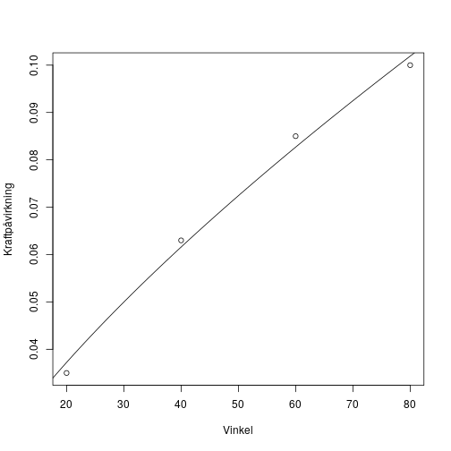

---
header-includes:
        \usepackage[utf8]{inputenc}
        \usepackage{xcolor}
        \usepackage{fancyhdr}
        \pagestyle{fancy}
        \lhead{Jeppe Møldrup}
        \chead{Matematik Aflevering 3}
        \rhead{24/9-2018}
---

# Matematik aflevering 3

## 1.005

En cirkel $C$ og en linge $l$ er bestemt ved

$$C: \ x^2 - 4x + y^2 + 2y = 11$$
$$l: y = x + 1$$

Bestem koordinatsættet til hvert af skæringspunkterne mellem $l$ og $C$  

Jeg ved at ved skærringspunktern er både $x$ og $y$ værdierne ens for $l$ og $C$.
Og da $l$ er bestemt ved $y = x + 1$ kan jeg bare indsætte $x + 1$ ind på
y's plads i cirklen $C$.

$$x^2 - 4x + \underbrace{(x + 1)^2}_{\text{Kvadratsætning}} + 2(x + 1) = 11$$
$$x^2 - 4x + x^2 + 1 + 2x + 2x + 2 = 11$$
$$2x^2 - 4x + 4x = 8$$
$$x^2=4 \Leftrightarrow x = 2 \vee x = -2$$

Så x værdierne til de to punkter er henholdsvis $2$ og $-2$. Nu kan
jeg indsætte dem ind i linjens ligning for at finde de tilhørerne
y-værdier

$$y = x + 1 \Leftrightarrow y = 2 + 1 = 3 \vee y = -2 + 1 = -1$$

Så de to punkter hvor cirklen og linjen skærer hinanden er $(2, 3)$ og $(-2, -1)$

## 1.006

En cirkel har centrum i punktet $C(3,-2)$ og gå gennem punktet $P(0,2)$.  
Bestem en ligning for tangenten til cirklen i punktet $P$.

Jeg ved fra afstandsfunktionen mellem en cirkels centrum og en linje
at linjen mellem centrum og punktet $P$ ligger retvinklet på tangenten
til punktet $P$. Så jeg kan bruge vektor $\vec{PC}$ som min normalvektor.
Og så kan jeg bruge skabelonen
$$a(x-x_0)+b(y-y_0)=0$$
Hvor $a$ og $b$ er koordinaterne til min normalvektor.  
$$3(x-0)-4(y-2)=0 \Leftrightarrow 3x-4y+8=0 \Leftrightarrow y=\frac{3}{4}x+2$$
Så linjens ligning vil være $y=\frac{3}{4}x+2$

## 1.049

En funktion $f$ er bestemt ved
$$f(x)=7\ln(x)-2x^2$$
Bestem en ligning for tangenten til grafen for $f$ i punktet $P(1, f(1))$

Jeg starter med at differentiere funktionen $f$
$$f'(x)=(7\ln(x)-2x^2)'=\frac{7}{x}-4x$$
Så indsætter jeg 1 ind i den differentierede funktion for at finde hældningen
til punktet $P$
$$f'(x)=\frac{7}{1}-4 \cdot 1=7-4=3$$
Så hældningen til ligningen for tangenten til punktet $P$ er $3$  
Så jeg indsætter det i en formel for lineær vækst
$$y=3x+b$$
Nu finder jeg den tilhørerne y-værdi til x-værdien $1$ ved at indsætte $1$
ind i funktion $f$
$$f(1)=7\ln(1)-2\cdot 1^2 = -2$$
Så punktet $P$ er altså $P(1, -2)$  
Jeg indsætter det i den lineære formel og isolerer b
$$-2=3\cdot 1+b \Leftrightarrow b=-5$$
Så ligningen for tangenten til grafen for $f$ i punktet $P$ er $y=3x-5$

## 1.074

Gøre rede for, hvilken graf der hører til hvilken funktion

Den røde graf hører til $f(x)$ fordi den blå graf har en negativ hældning i starten
mens den røde graf aldrig kommer under 0 på y-aksen så den kan ikke være den afledte
funktion til den blå.

## 9.217

Ved genoptræning af en patient efter en korsbåndsoperation i knært anvendes en maskine, som bøjer patientens knæ.
I tabellen ses sammenhørende værdier af den vinkel, som knæet køjes med, og den kraftpåvirkning, der registreres
i det nye korsbånd.

| Vinkel(grader)        | 20    | 40    | 60    | 80    |
| ---                   | ---   | ---   | ---   | ---   |
| Kraftpåvirkning(N)    | 0.035 | 0.063 | 0.085 | 0.10  |

I en model antages des, at kraftpåvirkningen i korsbåndet som funktion af vinklen er af typen
$$f(x)=b \cdot x^a, \qquad 0\leq x\leq 90$$
hvor $f(x)$ betegner kraftpåvirkningen(målt i N) ved vinklen $x$(målt i grader).

a. Bestem $a$ og $b$
   
   Jeg laver potensregression på dataet
   
   
   
   $a = 0.726$ og $b = 0.00422$
   \pagebreak

b. Jeg indsætter bare $45^{\circ}$ ind i funktionen
   
    
    ```
    ## [1] 0.06709623
    ```

   $$f(45^{\circ}) = 0.0671 \ N$$

c. Bestem hvor meget kraftpåvirkningen øges, når vinklen øges med $30\%$
   
   Da det er en potensfunktion kan jeg bruge formlen
   $$F_y=F_x^a$$
   hvor $F$ er fremskrivningsfaktoren for henholdsvis $x$ og $y$
   $$0.30^{0.726}\cdot 100\% = 11.8138\%$$
   Så for hver gang vinklen øges med $30\%$ så øges kraftpåvirkningen med $12\%$

## 9.234

En cirkel er givet ved ligningen
$$(x-2)^2 + (y+1)^2 = 100$$
og en linje $l$ er gived ved ligningen
$$3x+4y-7=0$$

a. Bestem afstanden fra cirklens centrum til linjen $l$
   
   Jeg har cirklens ligning i formen
   $$(x-x_0)^2+(y-y_0)^2=r^2$$
   hvor $(x_0, y_0)$ er cirklens centrum og $r$ er cirklens radius  
   Så cirklens centrum er $C(2, -1)$  
   Nu kan jeg bare bruge formlen for afstanden mellem et punkt og en linje
   $$dist(P, l) = \frac{|ax_1 + by_1 + c|}{\sqrt{a^2 + b^2}}$$
   Så jeg indsætter punktet og linjen
   $$dist(C, l) = \frac{|3 \cdot 2 + 4 \cdot -1 - 7|}{\sqrt{3^2 + 4^2}} = 1$$
   Så afstanden mellem cirklens centrum og linjen $l$ er $1$

Linjen $m$ går gennem cirklens centrum og er venkelret på $l$

b. Bestem koordinatsættet til hvert af skæringspunkterne mellem linjen $m$ og cirklen.
   
   Linjen $l$ har normalvektoren
   $$\vec{n_l}=\begin{pmatrix} 3 \\ 4 \end{pmatrix}$$
   Og da $m$ ligger ret på $l$ betyder det at $\vec{n}$ er retningsvektor for $m$,
   og $m$ går gennem cirklen centrum.
   så vi har en retningsvektor og et punkt for $m$,
   så vi kan hatte retningsvektoren for at få en normalvektor og så opstille linjens ligning
   $$\vec{n} = \hat{\vec{n_l}}= \begin{pmatrix} -4 \\ 3 \end{pmatrix}$$
   $$-4(x-2)+3(y+1)=0$$
   Jeg isolerer y i linjens ligning
   $$-4x+8+3y+3=0 \Leftrightarrow -4x+3y=-11 \Leftrightarrow y = \frac{4}{3}x-\frac{11}{4}$$
   Nu kan jeg indsætte det på y's plads i cirklens formel
   $$(x-2)^2 + ({\color{red}{y}} + 1)^2 = 100 \Leftrightarrow (x-2)^2 + ({\color{red}{\frac{4}{3}x-\frac{11}{4}}} + 1)^2 = 100$$
   Nu har jeg en lidt uoverskuelig ligning som jeg løser vha. solve
   $$solve((x-2)^2 + (\frac{4}{3}x-\frac{11}{4} + 1)^2 = 100, x) \rightarrow x = -4.4309 \vee x = 7.5509$$
   Nu kan jeg indsætte de to x-værdier ind i linjens ligning for at få de tilsvarende y-værdier
   $$y = \frac{4}{3} \cdot -4.4309 -\frac{11}{4} = -8.65786 \vee y = \frac{4}{3} \cdot 7.5509 -\frac{11}{4} = 7.31786$$
   Så de to skæringspunkter er henholdsvis $(-4.43, -8.66)$ og $(7.55, 7.32)$

## 9.237

I en model kan udviklingen i et barns højde de første 48 måneder beskrives ved differentialligningen
$$\frac{dh}{dt} = 5.24-0.045 \cdot h, \qquad 0 \le t \le 48$$
hvor $t$ er barnets alder(målt i måneder), og $h$ er barnets højde(målt i cm), I modellen er et barn 50 cm højt ved fødslen.

a. Benyt modellen til at bestemme væksthastigheden, når barnet er 100 cm højt.
   
   Jeg indsætter 100 cm ind i differentialligningen
   $$\frac{dh}{dt} = 5.24 - 0.045 \cdot 100 = 0.74 \frac{cm}{måned}$$
   Så væksthastigheden når barnet er 100 cm højt er 0.74 cm pr måned

b. Bestem en forskrift for $h$, og benys denne til at bestemme barnets alder, når det er 100 cm højt
   
   Differentialligningen følger formen
   $$\frac{dy}{dx}=b-ay$$
   Så løsning kommer til at være
   $$y = \frac{b}{a} + c \cdot e^{-a \cdot x}$$
   Så jeg indsætter værdierne
   $$h = \frac{5.24}{0.045} + c \cdot e^{-0.045 \cdot t}$$
   Jeg ved at i modellen er et barn 50 cm højt ved fødslen så jeg indsætter det og finder værdien af c
   $$50 = \frac{5.24}{0.045} + c \cdot e^{-0.045 \cdot 0} = \frac{5.24}{0.045} + c \Leftrightarrow c = 50 - \frac{5.24}{0.045} = -66.4$$
   Så den fulde løsning til differentiallignigen er
   $$h = \frac{5.24}{0.045} - 66.4 \cdot e^{-0.045 \cdot t}$$
   Så indsætter jeg 100 cm ind i højden og finder den tilsvarende alder vha. solve
   $$solve(100 = \frac{5.24}{0.045} - 66.4 \cdot e^{-0.045 \cdot t}, t) \rightarrow t = 31$$
   Så når et barn er 100 cm højt er det cirka 31 måneder gammelt
