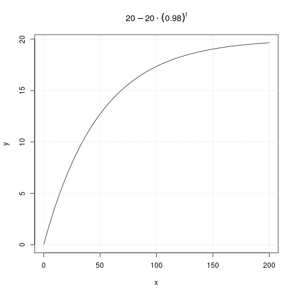

## 9.220
$$\frac{dC}{dt}=0.4-0.02C$$
$$C(t)=20-20 \cdot (0.98)^t$$

```r
c <- function(t){20-(20*(0.98)^t)}

x <- seq(0, 200, length=200)
y <- sapply(X=x, FUN=c)

plot(x, y, type='l', main = expression(20-20 %.% (0.98)^t))
grid()
```


